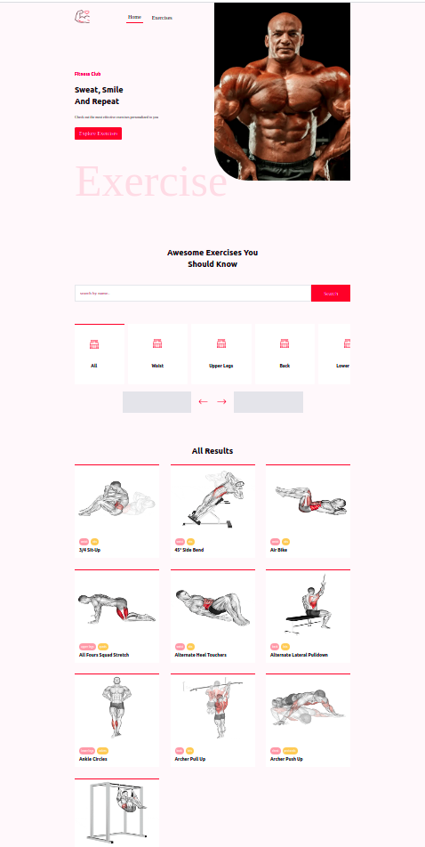
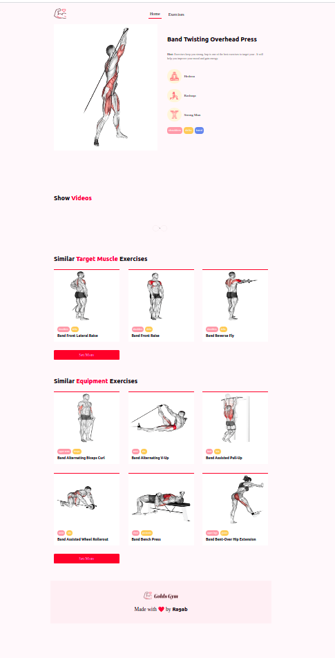

# Ramy-Fitness

- Welcome to **Ramy-Fintess app**, the place where you can fined the best excerices making your favourite plan, in order to build a healthy body, good body, ***But not Ramy's body :)*** as i can't promise you to be like him in our humble fitness, But here you can find the most excercises that you can imagine and play it the right way. You will alsoo get on some Information and Recommendations for any exercise that you'll choose;

 

---
---

## Technologies i used

- HTML5
- CSS3
- JavaScript
- React
- Nextjs
- Tailwindcss
- Figma
- Rapid API;
- YoutTube API V3 (Not yet.. after getting a key we'll..);

## Feature
- Custom pagination
- Custom fetching APIs;
- Custom state management as i used useContext and useReducer;
- Creating an API endpoint in nextjs using the API routes and making requests to it using axios in fetching data;

## A Word
- It is not bad written code, 
- The exercisesdb API is not a free, SO i tried to found a way to clone it to my server and i did it in fact, and
now i can make any number of requests :DD; ***That doesn't mean its illegal doing, as i still use the main api**
 .. But since it was a challenge, it must have ended with the word **done!**