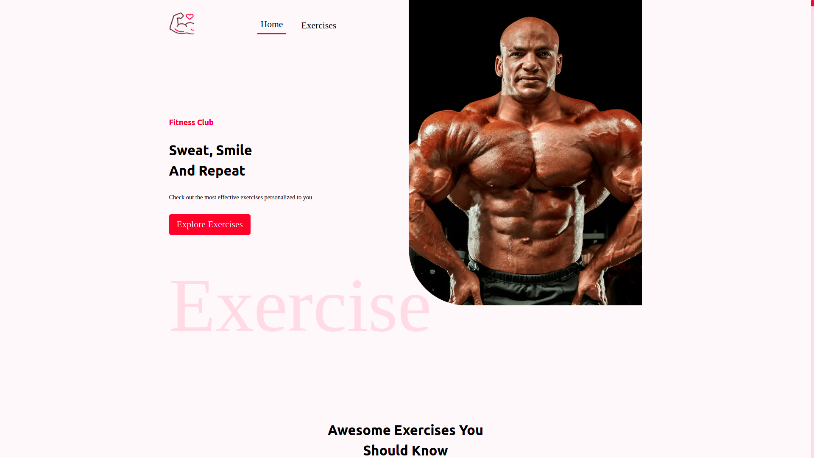

# Fitness_app

- Welcome to our fitness app, find the best plans and the best excerice to build your body, here you can find the most
excercises that you may need they are from the most famous API, RAPID API;

---
---

## Technologies i used

- HTML5
- CSS3
- JavaScript
- React
- Nextjs
- Tailwindcss
- Figma
- Rapid API

## A Word
- It is a well written code, great code specially **the three files of utils folder** realy great!
- Project state managed by the hooks useReducer and useContext
- Fetching done with using axios inside it was a challange for me to fetch data inside nextjs and useContext.. But since it was a challenge, it must have ended with the word **done!**